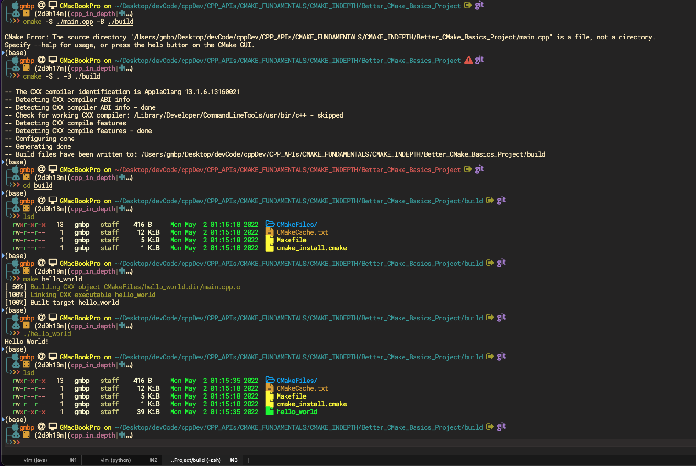

# CMake
##Basics and Tips and Tricks

### Introduction
As you use `cmake --help` you can see that the most common option to be used is

```shell
cmake [options] -S <path-to-source> -B <path-to-build>
```
I used

```shell
# Run at the home dir of our project
cmake -S ./main.cpp -B ./build

```
check this out here



