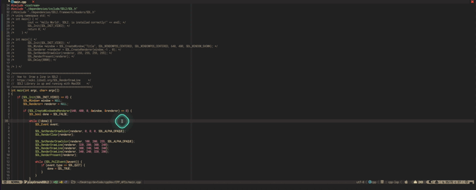

# Installing SDL 2.0 for Mac
 <!-- markdown-toc start - Don't edit this section. Run M-x markdown-toc-refresh-toc -->
**Table of Contents**

- [Installing SDL 2.0 for Mac](#installing-sdl-20-for-mac)
    - [Instructions](#instructions)
    - [Instructions -2-](#instructions--2-)
    - [Instructions -3-](#instructions--3-)
        - [Hint](#hint)
    - [Build with Cmake](#build-with-cmake)
    - [References](#references)

<!-- markdown-toc end -->


The following steps are based on the idea of installing `sdl2` binary/complied without a need to use the `xcode`.
The steps consist of two main things if we want to use only the binary.


<video src="./assets/Rendering_with_SDL2.mp4" width=80/>

## Instructions -1-
1. Install the binary of `sdl2` using

```shell
brew install sdl2
# It will be located at
cd /opt/homebrew/Cellar/sdl2/2.0.22
```
- It's a complied version of `SDL2`, so we don't need to build the project of `SDL2` from scratch.


2. Compile the project using

```shell
g++ main.cpp -I ./dependencies/SDL2.framework/Headers -o main  -std=c++20  && ./main
clang main.cpp -I/opt/homebrew/include -L/opt/homebrew/lib -lSDL2 -target x86_64-apple-darwin20.3.0 -o test.o
g++ main.cpp -I ./dependencies/SDL2.framework/Headers -L ./dependencies/SDL2.framework/Resources -o main  -std=c++20  && ./main
```

All these I was not able to compile my project with `SDL` it seems my Mac ARM
not compatible even with Metal.


## Instructions -2-
1. Go to SDL official website and download the `SDL2-2.022.dmg` from [SDL
   official website](https://www.libsdl.org/download-2.0.php), under the
   section `Development Libraries:` get the latest version of your SDL2.
2. Now we have all the required both the library and the headers, we can map
   them to our project using: this will give us the `SDL.h` directed to our current directory.

```cpp
#include "./dependencies/SDL2.framework/Headers/SDL.h"
```

3. Later I found the following, that as I already used `brew` I direct both the headers and the lib to these directories `opt/homebrew/include` and `opt/homebrew/lib`
not to mention the flag `lSDL2` to make it work.

```sh
g++ main.cpp -I/opt/homebrew/include -L/opt/homebrew/lib -lSDL2 -o main  && ./main
```
also, including in the header of your main file

```cpp
#include "./dependencies/SDL2.framework/Headers/SDL.h"
```

I got the same results if I use

```sh
g++ main.cpp -I./dependencies/SDL2.framework/Headers -L./dependencies/SDL2.framework/Resources -lSDL2 -o main  && ./main
# It supposed to be like:
g++ main.cpp -I./dependencies/SDL2.framework/Headers -L./dependencies/SDL2.framework/Resources -l./dependencies/SDL2.framework/SDL2 -o main  && ./main
```
but, this will work for my current dependencies file


## Instructions -3-

Steps that I created

1. Copy the contains of the `SDL2` library into your current project directory using

```shell
cp -r /opt/homebrew/Cellar/sdl2/2.0.22 ./dependencies/

```
2. Refer to it in your main.cpp using

```cpp
#include "./dependencies/include/SDL2/SDL.h"
```

3. Build your system using:
Once we directed the lib with the flag (-L) which is the absolute directory, we
can also add a relative directory (-l). Therefor the `-l SDL2` can refer also
to the directory of the form our already defined directory before.

```sh
g++ main.cpp -I./dependencies/include -L./dependencies/lib -lSDL2 -o main  && ./main
# Or as I don't like not adding spaces, like other developers do.
g++ main.cpp -I ./dependencies/include -L ./dependencies/lib -l SDL2 -o main  && ./main
# Or - This one I use -
g++ ./main.cpp -o main -I  dependencies/include -L dependencies/lib  -lSDL2 -std=c++17  && ./main
```

### Hint
- The `./dependencies/include/` has the header for all functions, attributes, classes, structs and methods declarations.
- The `./dependencies/lib/` has all the definitions.
- (-L) are the binary files to be linked to your final binary. Like `.so` or `.a files` in Linux for example
- (-I) is the directory that has the header files.
- We add (-lSDL2) to add the compiled static or shared library to your final executable


## Build with Cmake
- Assume we are at the root directory (which is our CPP_APIs) using the branch
`playGroundSDL2`. I needed to create `src` directory and then add the `main.cpp` directly to it.

1. For debuging mode I use

```sh
cmake -DCMAKE_BUILD_TYPE=Debug -S . -B build/debug
```
**Note**
- `-S`: for source file
- `-B`: for the build directory

2. For release mode I use

```sh
cmake -DCMAKE_BUILD_TYPE=Release -S . -B build/release
```
- For the `CMakeLists.txt` I added a script to convert our command line above

```cmake
cmake_minimum_required(VERSION 3.5)
project(YourProjectName CXX)

set(SOURCES src/main.cpp)

# Set the build type if not provided
if(NOT CMAKE_BUILD_TYPE)
    set(CMAKE_BUILD_TYPE "Debug" CACHE STRING "Choose the type of build (Debug or Release)" FORCE)
endif()

# Set the output directories
set(CMAKE_RUNTIME_OUTPUT_DIRECTORY ${CMAKE_SOURCE_DIR}/build/${CMAKE_BUILD_TYPE})

# Add the executable target
add_executable(main ${SOURCES})

# Include directories
target_include_directories(main PRIVATE dependencies/include)

# Link directories
target_link_directories(main PRIVATE dependencies/lib)

# Link libraries
target_link_libraries(main PRIVATE SDL2)

# Set compiler flags
set(CMAKE_CXX_STANDARD 17)
set(CMAKE_CXX_FLAGS_DEBUG "${CMAKE_CXX_FLAGS_DEBUG} -Wall -Wextra -g")
set(CMAKE_CXX_FLAGS_RELEASE "${CMAKE_CXX_FLAGS_RELEASE} -O3")

```
3. Now go to each directory `build/debug` or `build/release` and use `make` or
   `ninja` to generate your binary. Same apply if you use `cmake --build . `
All of these will create the binary at the given directory.

**Note**
- Using `-O3` for optimization in the release model as you can see in the
`CMakeList.txt`.
- Using `-Wall -Wextra` means treat the `warning` as error in debug model to be
handled carefully and creates extra safety net.
- Note that I can use `//#include <SDL2/SDL.h>` As we have already defined it
in our `CMakeList.txt` but depends on your language server, it will  (for nvim `clangd`)
is installed using `Mason` from nvim. I configured it by adding a file called
`.clangd` at the root directory ([read more
here](https://clangd.llvm.org/config) under the project configuration) Also you
can read
[here](https://medium.com/linux-with-michael/how-to-setup-clangd-with-gcc-headers-and-neovim-lsp-for-competitive-programming-2f3f98425ae1)
Now, We can use `#include <SDL2/SDL.h>` Instead  of `#include
"../dependencies/include/SDL2/SDL.h"`.
    - This will work for both `emacs` and `nvim` as both are using the same server `clangd`.


### clang-format
I have used `clang-format` to keep on formatting my buffer on save. Simply
```sh
brew install clang-format
```

## References

- [Setup SDL2 on your Mac without Xcode](https://medium.com/@edkins.sarah/set-up-sdl2-on-your-mac-without-xcode-6b0c33b723f7)
- [SDL Wiki](https://wiki.libsdl.org/Installation)
- [CMake Super-builds and Git Sub-modules](https://www.kitware.com/cmake-superbuilds-git-submodules/?fbclid=IwAR2ANzGXdfT5Hs_LErPS-I8PIZEBoNZ6hmCmZTyLM5uiXmU7ZNIGhN6EZgA)
